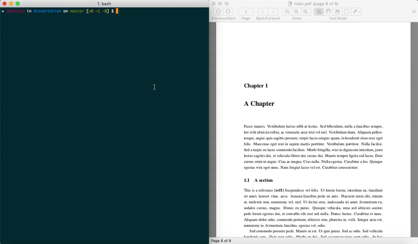

# Dissertation

I created this repo mostly to remind myself in the future how to work with [LaTeX](https://www.latex-project.org).
If you, however, find value in anything here please go right ahead and take what you want.

Here you can find the LaTeX template that I prepared for my dissertation.
The template is written cleanly enough for anyone to pick it up. Also, I tried to keep everything tidy in its own folder.
Personally I prefer working from the command line, so I also prepared some tooling for automating the building process of the document from the CLI.

## Dependencies

All you need to build the document is to install a LaTeX distribution on your machine, and possibly [Python3](https://www.python.org/download/releases/3.0/) (if you plan to build your document using the provided `Makefile`).
I'd recommend going for the [MiKTeX](https://miktex.org/download) distribution if you're on Windows 10 or [MacTeX](http://www.tug.org/mactex/) if you're on macOS.

You can use [Homebrew](https://brew.sh) to install MacTeX on macOS: `brew cask install mactex`. This will install the full version of the distribution along with the full set of LaTeX packages, most of which you won't need.
In case you wanted a more lightweight installation you can look into [BasicTeX](http://www.tug.org/mactex/morepackages.html) (which is a stripped down version of MacTeX) or [TinyTeX](https://yihui.name/tinytex/) (which is cross-platform and thus will work on Windows 10 as well).
If you go down this route, you might need to install a few missing packages. You can use the [TeX Live Manager](https://www.tug.org/texlive/doc/tlmgr.html) (`tlmgr`) tool to install these, which should get you going:

```bash
# The commands below install all the packages you need for building the document.
# Depending on the location of `tlmgr`, you might need to prepend `sudo` to these.

tlmgr update --self
tlmgr install acro biber biblatex enumitem fancyhdr koma-script lipsum logreq psnfss setspace titlesec translations
tlmgr update --all
tlmgr path add
```

## Editing LaTeX files

Any text editor and PDF viewer should do it. When working on macOS I usually edit my LaTeX files using the [vim](https://www.vim.org) + [Skim](https://skim-app.sourceforge.io) combo.
Installing a few vim plugins will generally make your life easier. Notably, the [vimtex](https://github.com/lervag/vimtex) plugin will be your new best friend when editing LaTeX files in vim.
Don't forget to switch on the "Check for file changes" and "Reload automatically" options in the Skim preferences.

## Building the document

On *NIX systems, you can leverage the provided `Makefile` for building the document in PDF format.
Use `make refs` for running the script that prepares the bibliography references to be used in the document, `make diss` for building the document in PDF format, or `make all` for both.
On Windows 10, I'd recommend using [Visual Studio Code](https://code.visualstudio.com) along with the [LaTeX Workshop](https://marketplace.visualstudio.com/items?itemName=James-Yu.latex-workshop) extension, which provides many nice features for working with LaTeX files including building the document from the editor.



## References

- https://www.bilalakil.me/getting-started-and-productive-with-latex-basictex-on-os-x-terminal/
